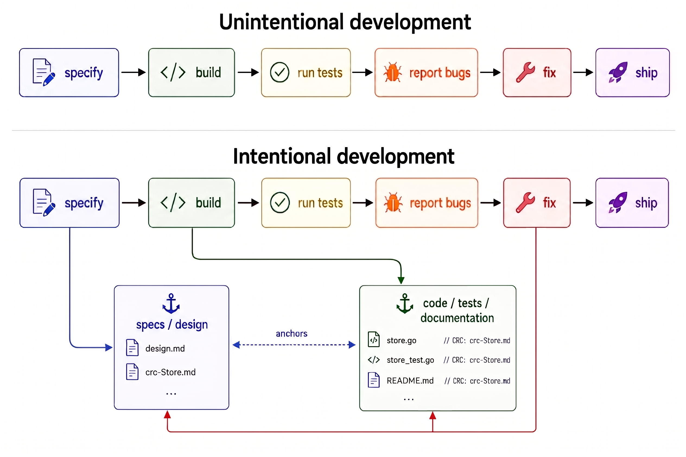

# Don't sit back and watch as vibe-coding creates an unintentional system

The vibe-coding genre describes **unintentional development**. Six verbs. Pure motion. Where does anything persist?

The vision for the code is in a prompt. By the time you need to fix your code, the prompt is gone and the AI can't see it. Your prompt said why. Now you're coding blind.

The vibe-coding process robs your system of intent. Without it, you end up with an **unintentional system**.

An "intent-free" system doesn't say *why* you made any of it. No reasons for anything.

And without *why*, there are no guidelines at all for what to keep, what to change, and what to throw away.

**Intentional development** is the alternative. Same six verbs, but three of them deposit into **anchored** documents: *specify* produces specs/design, *build* produces code/tests/documentation, *fix* propagates back into both.

The anchors are bidirectional: design.md says `crc-Store.md → store.go`; store.go says `// CRC: crc-Store.md`.

Even spec-driven development can create unintentional systems. Once the spec and code grow, the spec won't fit in context, and the agent can't see all of it. Anchors let the agent reach the relevant fragment by reference. **Anchoring scales.**

The *fix* loop-back preserves **intent**. A correction doesn't just go forward to the next ship; it propagates backward through both anchored blocks. The lesson the bug report taught survives the bug report.

The genre tells you this is a skill problem: write better bug reports, manage the loop better. That's a person-shaped fix.

It's an artifact problem. Skills don't survive sessions; written things do. The bug reports you write today vanish tomorrow unless their lessons are anchored back into documents that outlive the session.

Three months ago I described the **three-level process for AI development**: specs → design → code, anchored both ways:

https://github.com/zot/mini-spec/blob/main/docs/3-level-process-v1.md

This is what happens when you skip it.

Don't sit back and watch as vibe-coding creates an unintentional system. **Anchor it.**
